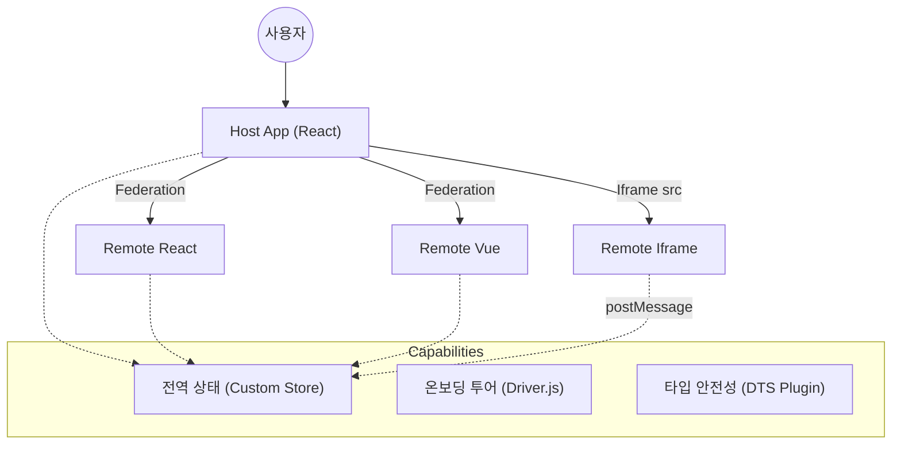

# 모듈 페더레이션 플레이그라운드 (Module Federation Playground)

> **각 서비스별 상세 문서 바로가기:**
> [📚 Host App](./host-app/README.md) | [⚛️ Remote React](./remote-react/README.md) | [💚 Remote Vue](./remote-vue/README.md) | [🖼️ Remote Iframe](./remote-iframe-react/README.md)

`@module-federation/vite`, React, Vue, 그리고 Iframe을 활용한 마이크로 프론트엔드(Micro-Frontends) 아키텍처를 종합적으로 보여주는 데모 프로젝트입니다.

## 🏗 아키텍처 (Architecture)

이 프로젝트는 **React, Vue, Iframe** 등 서로 다른 기술 스택을 가진 독립적인 애플리케이션들이 **Module Federation**을 통해 어떻게 하나의 통합된 사용자 경험을 제공하는지 보여주는 **실무형 마이크로 프론트엔드(Micro-Frontends) 예제**입니다.

전체 시스템의 아키텍처 구조는 다음과 같습니다.



## 🚀 애플리케이션 목록

| 애플리케이션      | 포트   | 기술 스택         | 설명                                          |
| ----------------- | ------ | ----------------- | --------------------------------------------- |
| **Host App**      | `5000` | React, Vite       | 메인 컨테이너, 전역 상태 관리, 레이아웃 담당  |
| **Remote React**  | `5001` | React, Vite, GSAP | 헤더(Header) 및 인터랙티브 카드 컴포넌트 노출 |
| **Remote Vue**    | `5002` | Vue 3, Vite       | 데이터 시각화가 포함된 대시보드 컴포넌트 노출 |
| **Remote Iframe** | `5003` | React, Iframe     | 완전히 격리된 환경에서 실행되는 애플리케이션  |

## ✨ 주요 기능

### 1. 다중 프레임워크 페더레이션 (Multi-Framework Federation)

`@module-federation/vite`를 사용하여 **React**와 **Vue** 컴포넌트를 단일 React Host 애플리케이션에 매끄럽게 통합합니다.

### 2. 전역 상태 관리 (Global State Management)

- **공유 스토어**: 직접 구현한 **경량 Pub/Sub 스토어**를 Host, Remote React, Remote Vue가 공유합니다.
- **Iframe 동기화**: `window.postMessage`를 통해 격리된 Iframe 애플리케이션과 상태를 동기화하여, 경계를 넘어선 통합된 사용자 경험을 제공합니다.

### 3. 타입 안전성 (Type Safety)

- `@module-federation/dts-plugin`을 사용하여 페더레이션 모듈에 대한 TypeScript 정의(`.d.ts`)를 자동으로 생성하고 소비합니다.
- Host App은 수동 복제 없이 Remote의 타입을 추론할 수 있습니다.

### 4. 인터랙티브 UI & 애니메이션

- **GSAP**: Remote React에서 고성능 애니메이션을 구현하는 데 사용되었습니다.
- **시각적 피드백**: 전역 상태가 변경되면 모든 마이크로 프론트엔드에서 시각적 신호(반짝임, 스케일 효과)가 발생하여 동기화 상태를 직관적으로 보여줍니다.

### 5. 온보딩 투어 (Onboarding Tour)

- `driver.js`를 통합하여 아키텍처와 기능을 설명하는 인터랙티브 가이드를 앱 내에서 직접 제공합니다.

## 🛠 빌드 및 배포 (Build & Deploy)

이 프로젝트는 **GitHub Actions**를 사용하여 모든 애플리케이션을 빌드하고 **GitHub Pages**에 통합 배포합니다.

```bash
# 의존성 설치 (루트)
npm install

# 전체 앱 실행
npm run dev --workspaces
```

### 배포 구조

- Host: `/module-federation-playground/`
- Remote React: `/module-federation-playground/remote-react/`
- Remote Vue: `/module-federation-playground/remote-vue/`
- Remote Iframe: `/module-federation-playground/remote-iframe-react/`
