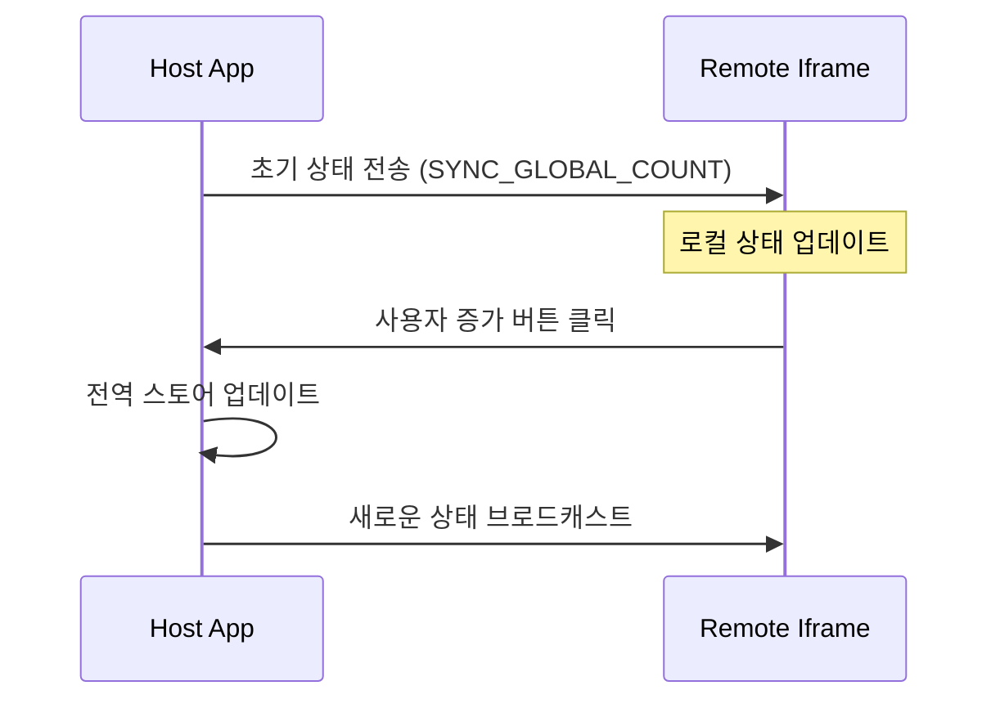

# Remote Iframe Application

[🚀 라이브 데모 보러가기](https://minoong.github.io/module-federation-playground/)

`<iframe>`을 통해 통합되는 완전히 격리된 React 애플리케이션입니다.

<br/>


https://github.com/user-attachments/assets/4512189c-8ae1-4b41-b9c0-8b2e297c008b

<br/>

## 🔒 격리 및 통신 (Isolation & Communication)

표준 Module Federation 모듈과 달리, 이 앱은 별도의 문서 컨텍스트(Document Context)에서 실행됩니다. 이는 완전한 격리(CSS, JS 변수 등)를 보장하지만, 상태 공유를 위해서는 다른 접근 방식이 필요합니다.

### 상태 동기화 전략 (State Synchronization Strategy)

우리는 **Window Messaging API (`postMessage`)**를 사용하여 Host App과 전역 카운트 상태를 동기화합니다.GitHub에서는 아래 시퀀스 다이어그램이 렌더링되어 보입니다.



## 🛠 기술 스택

- **프레임워크**: React 19
- **빌드 도구**: Vite
- **스타일링**: Tailwind CSS
- **애니메이션**: GSAP

## 🚀 개발 환경 실행

```bash
npm run dev
# http://localhost:5003 에서 실행됨
```
